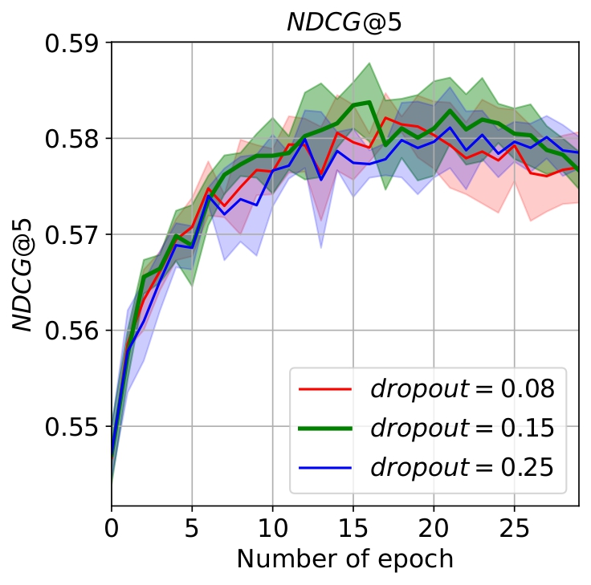
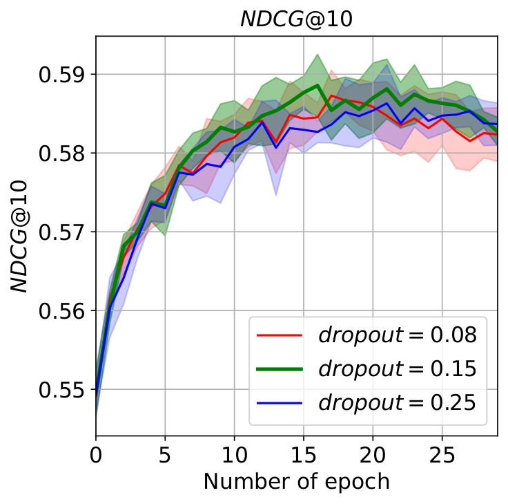
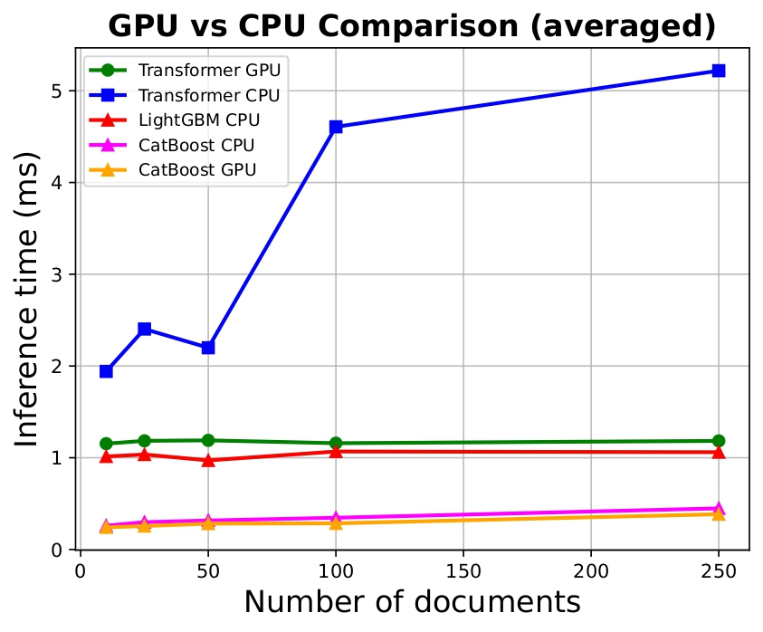
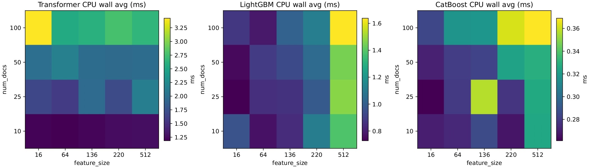

# Learning-To-Rank with Transformer Models

This repository contains an implementation of Learning-to-Rank methods based on the Transformer Encoder architecture. The project is designed for ranking documents by relevance to queries using deep neural networks.

## Project Description

The project implements approaches to the ranking task (Learning-to-Rank) using transformer architectures. The model is based on the Encoder architecture and supports various loss functions (pointwise, listwise, combined), enabling efficient training of models for document ranking.
# Results for a rebuttal
## Extension of Table 1 with additional datasets and ERR metric

|           |**Web10K**|        | **Web30K** |       | **Yahoo!** |       | **Istella** |       |
|-----------|-------- |--------------|------------|-------|------------|-------|-------------|-------|
|           |*NDCG@5*   | *ERR*| *NDCG@5*   | *ERR* | *NDCG@5*   | *ERR* | *NDCG@5*    | *ERR* |
| TabNet    |39.51|30.15| 40.32      | 30.74 | 66.95      | 38.01 | 64.34       | 33.11 |
| MLP       |52.81|35.23| 54.12      | 36.84 | 75.28      | 43.15 | 70.81       | 37.12 |
| **TransPointRank** |**56.30**|**36.42**| **58.38** | **37.51** | **77.85** | **43.40** | **74.46** | **38.10** |

## Evaluation of the impact of different dropout rates on the best-performing architecture using the metric $NDCG@k$ (Web30k dataset) 

 |  |
 

## Comparison of time inference for TransPointRank(GPU/CPU), LightGBM ranker(CPU) and CatBoost ranker(CPU)  




### Key Features

- **Transformer Encoder model** for document ranking
- **Multiple loss functions**: Pointwise (Cross-Entropy), Listwise (ListNet), Combined Loss
- **Comprehensive metric evaluation**: NDCG@5, NDCG@10, NDCG (full), ERR@k
- **Analysis utilities**: inference time measurement, memory usage estimation
- **Fine-tuning support** for models
- **Visualization** of training results and comparison of different architectures


## Model Architecture

The model is a Transformer-based Encoder:

```
Input (num_docs × num_features)
    ↓
Input Projection (Linear)
    ↓
Transformer Blocks (× N layers)
    ├─ Multi-Head Self-Attention
    ├─ Residual Connection + Layer Norm
    ├─ Feed-Forward Network
    └─ Residual Connection + Layer Norm
    ↓
Output Layer (Linear → num_classes)
    ↓
Scores (num_docs × num_classes)
```

### Model Parameters

- `d_model`: Model dimension (default: 512)
- `n_heads`: Number of attention heads (default: 2-4)
- `n_layers`: Number of transformer blocks (default: 2)
- `ffn_hidden`: FFN hidden layer dimension (default: 512)
- `input_dim`: Input feature dimension (depends on dataset)
- `output_dim`: Number of relevance classes (default: 5)
- `dropout_rate`: Dropout coefficient (default: 0.15)

### Installing Dependencies

```bash
pip install torch torchvision torchaudio
pip install numpy pandas scikit-learn matplotlib
pip install thop  # For FLOPs counting (optional)
```

## Usage

### 1. Data Preprocessing
Any of the provided datasets can be downloaded from the internet in .txt format. To convert them to **.pkl** format, use 
```bash
python Transformers/utils/txt_to_pkl.py --txt_path PATH --pkl_path PATH_TO_SAVE 
```

Data should be in pickle file format with the following structure:
- `fl_features`: document features
- `labels`: relevance labels (0-4)
- `query_id`: query identifiers

Usage example:

```python
from utils.preprocess import preprocess_data

train_data = preprocess_data(
    file_path='path/to/train.pkl',
    num_docs=140,        # Maximum number of documents per query
    is_shuffle=True,     # Whether to shuffle documents
    device='cuda'
)
```

### 2. Creating the Model

```python
from utils.Encoder_model import make_Encoder_model

model = make_Encoder_model(
    d_model=512,
    n_heads=2,
    n_layers=2,
    ffn_hidden=512,
    input_dim=699,       # Feature dimension
    output_dim=5,        # Number of classes
    dropout_rate=0.15,
    device='cuda'
)
```

### 3. Training the Model

The main training pipeline is in `Training and evaluation.ipynb`:

```python
from utils.train_eval_utils import train_eval
from utils.loss_mask_utils import Combined_Loss, create_mask
from sklearn.metrics import ndcg_score

loss_fn = Combined_Loss(theta=0.01, num_of_labels=5, distribution='polynomial', degree=2)

train_params = {
    'train_loader': train_loader,
    'model': model,
    'optimizer': optimizer,
    'loss_fn': loss_fn,
    'num_epochs': 25,
    'create_mask': create_mask,
    'val_loader': val_loader,
    'score_fn': ndcg_score,
    'name': 'best_model'
}

losses, metrics = train_eval(**train_params)
```

### 4. Metric Evaluation

The `train_eval` function automatically computes multiple ranking metrics:

#### Ranking Quality Metrics

- **NDCG@5**: Normalized Discounted Cumulative Gain on top-5 documents
- **NDCG@10**: NDCG on top-10 documents
- **NDCG (full)**: NDCG on all documents in the ranking

#### Rank-based Metrics
- **ERR (Expected Reciprocal Rank)**: Measures the expected position at which a user becomes satisfied with the ranking

All metrics are computed during validation and displayed in the console output. The metrics dictionary returned by `train_eval` contains lists of all metric values for each epoch, enabling detailed analysis of model performance over time.

### 5. Fine-tuning

To fine-tune an existing model, use `finetune.ipynb`:

```python
from utils.preprocess import Dataset_for_finetune, preprocess_for_finetune
from utils.train_eval_utils import train_eval
from utils.loss_mask_utils import cross_entropy_for_finetune

# Load model
model = make_Encoder_model(**model_params)
state_dict = torch.load('path/to/model.pth')
model.load_state_dict(state_dict)

# Fine-tuning with new loss function
loss_fn = cross_entropy_for_finetune
# ... further configuration
```

## Loss Functions

The project supports several loss functions:

### 1. Pointwise Loss (Cross-Entropy)
A classical approach treating ranking as classification by relevance classes.

```python
from utils.loss_mask_utils import Cross_Entropy_point

loss_fn = Cross_Entropy_point(num_of_label=5)
```

### 2. Listwise Loss (ListNet)
A listwise approach that considers the relevance distribution in the list.

```python
from utils.loss_mask_utils import ListNet_Loss

loss_fn = ListNet_Loss(distribution='polynomial', degree=2)
# or
loss_fn = ListNet_Loss(distribution='softmax')
```

### 3. Combined Loss
A combination of pointwise and listwise losses.

```python
from utils.loss_mask_utils import Combined_Loss

loss_fn = Combined_Loss(
    theta=0.01,                    # Weight for listwise loss
    num_of_labels=5,
    distribution='polynomial',
    degree=2
)
```

## Evaluation Metrics

The framework provides comprehensive evaluation metrics for ranking tasks:

### Available Metrics

1. **NDCG (Normalized Discounted Cumulative Gain)**
   - Measures ranking quality considering position and relevance
   - Computed at different cutoffs: @5, @10, and full ranking

2. **ERR (Expected Reciprocal Rank)**
    - Measures the expected position at which a user becomes satisfied with the ranking
    - Uses a probabilistic satisfaction model: each document has a probability of satisfying the user
    - Earlier relevant documents contribute more, but diminishing returns are modeled via a product of "not satisfied yet" probabilities
    - Sensitive to both rank position and graded relevance levels (via transformation of relevance to satisfaction probability)
    - Returns 0 if all relevance values are zero or no relevant documents are found

## Performance Analysis

### Inference Time Measurement

Use `inference_time.ipynb` for model performance analysis:

- Static memory estimation (parameters, buffers)
- Peak memory usage during inference
- Forward pass execution time

### Memory Measurement

```python
from inference_time import estimate_inference_memory_static, measure_inference_peak_memory

# Static estimation
static_info = estimate_inference_memory_static(model)
print(static_info['pretty'])

# Peak usage during inference
memory_info = measure_inference_peak_memory(model, sample_input, warmup=5, steps=10)
print(memory_info['cuda_peak']['pretty'])
```

## Experiment Results

The `done pictures/` folder contains results from experiments with various:
- Model architectures
- Loss functions (pointwise, listwise, combined)
- Hyperparameters (dropout, polynomial degree)
- Datasets (Web10k, Istella)

### Data Preprocessing

The `Dataset_for_transformer` class creates a Dataset for PyTorch DataLoader:

```python
from utils.preprocess import Dataset_for_transformer
from torch.utils.data import DataLoader

dataset = Dataset_for_transformer(preprocessed_data)
loader = DataLoader(dataset, batch_size=128, shuffle=True)
```